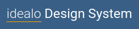

# idealo Next Web Platform

**Version 1.0.0**

As part of the **idealo Design System**, the **Next Web Platform** is a marketing-website created for designers and developers at idealo to exchange ideas and problem-solutions about the **idealo Design System**.

---

### Contributors

- Nicolas Forgerit
- Eda Güngör
- Grace Dodi
- Hai Trang Vu Thi
- Julia Schafferus
- Lilit Harutyunyan
- Pede Mahulomé
- Bettina Müller
- Lara-Sumru Kiyicioglu
- Iuliia Romanova
- Svenja Krauß
- Esra Oezkan
- Lucia Feddersen

---
## Installation

Here are the steps to run this project on your local machine:

### 1. Cloning the project

`git clone https://github.com/idealo/nwp`
- change into the */nwp/packages/idealo.design* directory

### 2. Installing dependencies

**Install npm if not already installed & make sure you are using the latest version of npm!**

Check for your npm version with: `npm --version`

**Then run:**

`npm install`

### 3. Setting up node.js

**Install node.js if not already installed:**

- use the node installer found at https://nodejs.org/en/download/

or

- use nvm to install

  `nvm install node`

**Make sure your node version is between 13.9.0 and 14.17.0!**

Check for your node version with: `node -v`or `nvm version`
Change your node version with: `nvm install v<version>`

### 4. Installing and running docker

Install docker by following instructions found on the official docker website https://docs.docker.com/engine/install/.

Use `docker run -d -p 6379:6379 -t redis` to run redis key-value database.

### 5. Compiling with webpack

- run `npx webpack`

### 6. Starting the server

- nagivate into the */dist* directory

- run the node server: `POSTGRES_URL=postgres://postgres@localhost:5432/idealodesign node server.js`

**Success!** - **You can now find idealo Design System under `localhost:8080`**

--- 

### License & copyright

information about license and copyright  

 

 
%
